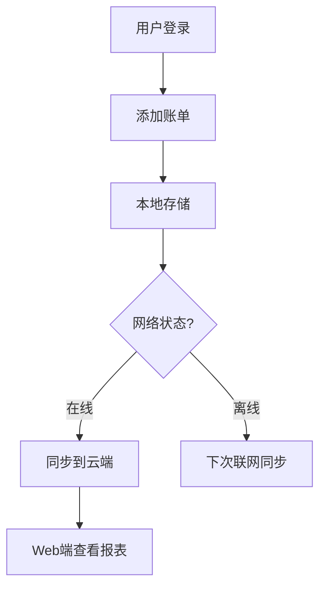

# CashFlow - 多端协作记账应用

## 目录
1. [项目概述](#项目概述)
2. [功能特性](#功能特性)
3. [技术架构](#技术架构)
4. [数据同步流程](#数据同步流程)

## 项目概述

CashFlow是一个支持多端同步的个人记账工具，主要特点：
- 📱 移动端优先的记账体验
- 🌐 Web管理后台数据分析
- ⚡ 离线可用，自动同步
- 📊 可视化财务报表

## 功能特性

### 核心功能
- 账单CRUD操作（创建、读取、修改、删除）
- 多维度财务分析（按分类/时间）
- 离线数据存储与自动同步
- 多设备数据一致性

### 用户流程


## 技术架构

### 移动端 (React Native)
| 技术栈       | 用途                 | 优势              |
|--------------|----------------------|-------------------|
| React Native | 跨平台UI开发         | 代码复用,高性能   |
| Zustand      | 状态管理             | 轻量,响应式       |
| SQLite       | 本地数据存储         | 离线支持          |

### 管理后台 (Next.js)
| 技术栈       | 用途                 | 优势              |
|--------------|----------------------|-------------------|
| Next.js      | 全栈框架             | SSR,API路由集成   |
| Prisma       | ORM工具              | 类型安全          |
| PostgreSQL   | 云端数据库           | 可靠,可扩展       |

## 数据同步流程

```mermaid
sequenceDiagram
    participant App
    participant SyncAPI
    participant Database
    
    App->>SyncAPI: POST /sync (带时间戳)
    SyncAPI->>Database: 查询最新版本
    Database-->>SyncAPI: 返回差异数据
    SyncAPI->>App: 返回合并结果
    App->>SyncAPI: 确认同步完成
