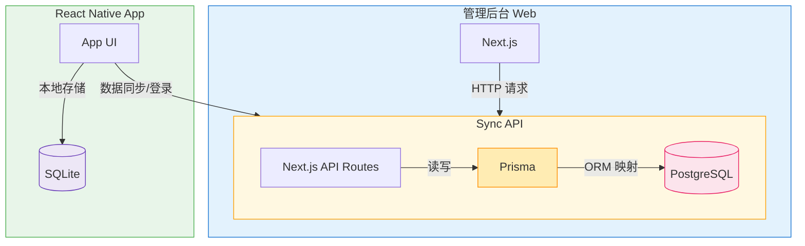

# CashFlow 系统架构

## 整体架构图

## 架构说明

### 1. 管理后台 Web
- 技术栈: Next.js
- 功能: 提供管理界面
- 通信: 通过HTTP请求与Sync API交互

### 2. Sync API
- 技术栈: Next.js API Routes + Prisma
- 数据库: PostgreSQL
- 功能: 
  - 处理业务逻辑
  - 数据持久化
  - 提供RESTful API

### 3. React Native App
- 技术栈: React Native
- 本地存储: SQLite
- 功能:
  - 移动端用户界面
  - 本地数据存储
  - 与Sync API同步数据
