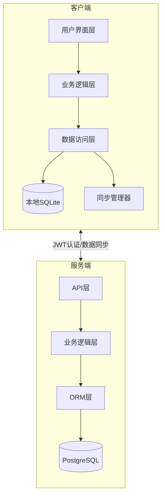
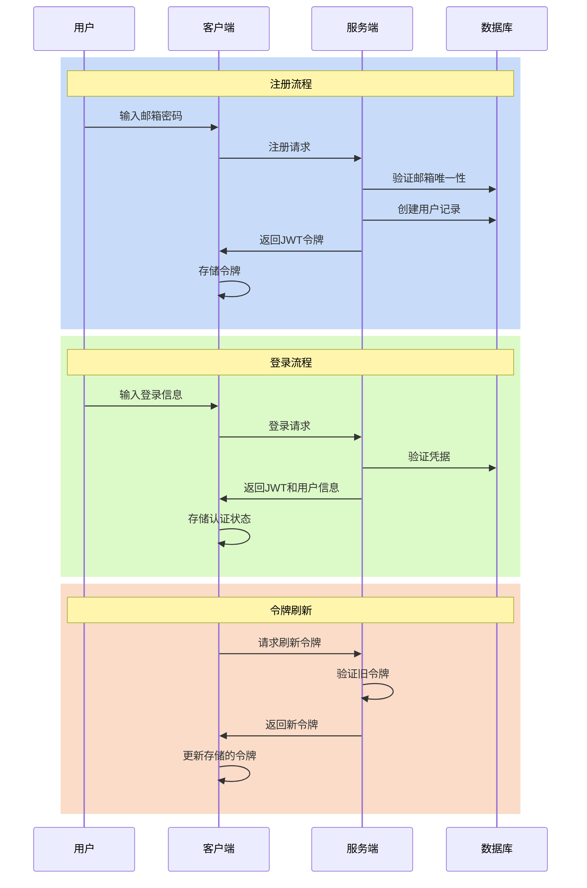
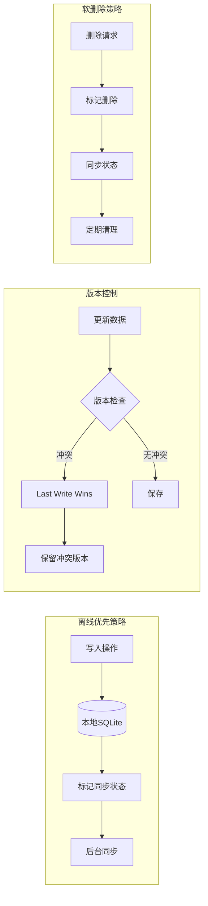
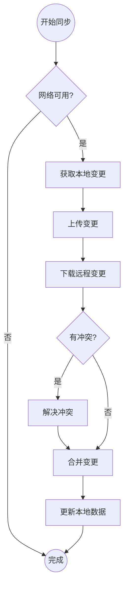

# CashFlow 认证与存储系统设计文档

> 最后更新: 2025-05-20
> 状态: 设计阶段

## 1. 系统概述

### 1.1 系统架构



### 1.2 设计目标

- 实现安全可靠的用户认证系统
- 设计高效的离线存储架构
- 支持多端数据同步
- 确保良好的离线使用体验
- 保持系统扩展性

### 1.2 技术栈选择

**移动端**:
- React Native 0.79.0
- SQLite (react-native-sqlite-storage)
- Zustand (状态管理)
- React Query (数据缓存)
- JWT (认证)

**Web端**:
- Next.js (App Router)
- PostgreSQL + Prisma
- JWT (认证)

## 2. 认证系统设计

### 2.1 用户模型

```typescript
interface User {
  id: string;          // UUID
  email: string;       // 用户邮箱
  password: string;    // 加密存储
  name: string;        // 用户名称
  created_at: Date;    // 创建时间
  updated_at: Date;    // 更新时间
  last_sync_at: Date;  // 最后同步时间
}
```

### 2.2 认证流程



1. **注册流程**:
   - 用户提供邮箱和密码
   - 服务端验证邮箱唯一性
   - 密码加密存储
   - 创建用户记录
   - 返回JWT令牌

2. **登录流程**:
   - 用户提供邮箱和密码
   - 服务端验证凭据
   - 生成JWT令牌
   - 返回用户信息和令牌

3. **令牌管理**:
   - 令牌有效期: 30天
   - 支持令牌刷新
   - 客户端安全存储令牌

### 2.3 移动端认证实现

```typescript
interface AuthStore {
  user: User | null;
  token: string | null;
  isAuthenticated: boolean;
  login: (email: string, password: string) => Promise<void>;
  logout: () => void;
  refreshToken: () => Promise<void>;
}
```

## 3. 存储系统设计

### 3.1 数据模型

```typescript
// 基础模型接口
interface BaseModel {
  id: string;           // UUID
  user_id: string;      // 关联用户ID
  created_at: Date;     // 创建时间
  updated_at: Date;     // 更新时间
  is_deleted: boolean;  // 软删除标记
  version: number;      // 版本号(用于同步)
  sync_status: 'pending' | 'synced' | 'conflict';
}

// 账单记录
interface Transaction extends BaseModel {
  amount: number;       // 金额
  type: 'income' | 'expense';
  category_id: string;  // 分类ID
  description: string;  // 描述
  date: Date;          // 交易日期
  tags: string[];      // 标签
}

// 分类
interface Category extends BaseModel {
  name: string;        // 分类名称
  icon: string;        // 图标
  type: 'income' | 'expense';
  color: string;       // 颜色
}
```

### 3.2 SQLite 表结构

```sql
-- 用户表
CREATE TABLE users (
  id TEXT PRIMARY KEY,
  email TEXT UNIQUE NOT NULL,
  name TEXT NOT NULL,
  created_at TEXT NOT NULL,
  updated_at TEXT NOT NULL,
  last_sync_at TEXT
);

-- 交易记录表
CREATE TABLE transactions (
  id TEXT PRIMARY KEY,
  user_id TEXT NOT NULL,
  amount REAL NOT NULL,
  type TEXT NOT NULL,
  category_id TEXT NOT NULL,
  description TEXT,
  date TEXT NOT NULL,
  created_at TEXT NOT NULL,
  updated_at TEXT NOT NULL,
  is_deleted INTEGER DEFAULT 0,
  version INTEGER DEFAULT 1,
  sync_status TEXT DEFAULT 'pending',
  FOREIGN KEY (user_id) REFERENCES users(id),
  FOREIGN KEY (category_id) REFERENCES categories(id)
);

-- 分类表
CREATE TABLE categories (
  id TEXT PRIMARY KEY,
  user_id TEXT NOT NULL,
  name TEXT NOT NULL,
  icon TEXT NOT NULL,
  type TEXT NOT NULL,
  color TEXT NOT NULL,
  created_at TEXT NOT NULL,
  updated_at TEXT NOT NULL,
  is_deleted INTEGER DEFAULT 0,
  version INTEGER DEFAULT 1,
  sync_status TEXT DEFAULT 'pending',
  FOREIGN KEY (user_id) REFERENCES users(id)
);
```

### 3.3 存储策略



1. **离线优先**:
   - 所有操作优先写入本地SQLite
   - 标记同步状态为pending
   - 后台异步同步到服务器

2. **数据版本控制**:
   - 每条记录维护版本号
   - 使用Last Write Wins策略处理冲突
   - 保留冲突记录供用户手动解决

3. **软删除**:
   - 不直接删除数据
   - 使用is_deleted标记
   - 同步后在适当时机清理

## 4. 数据同步机制

### 4.1 同步策略



1. **增量同步**:
   - 基于时间戳和版本号
   - 仅同步变更数据
   - 支持双向同步

2. **同步流程**:
   ```typescript
   interface SyncProcess {
     // 上传本地变更
     uploadChanges: () => Promise<void>;
     // 下载远程变更
     downloadChanges: () => Promise<void>;
     // 解决冲突
     resolveConflicts: () => Promise<void>;
   }
   ```

3. **同步触发机制**:
   - 用户手动触发
   - 网络恢复自动触发
   - 定期后台同步
   - 重要操作后触发

### 4.2 冲突处理

1. **冲突检测**:
   - 比较版本号和时间戳
   - 标记冲突状态

2. **解决策略**:
   - 自动采用Last Write Wins
   - 保存冲突版本
   - 提供用户手动解决界面

## 5. 安全考虑

### 5.1 数据安全

- SQLite数据库加密
- 敏感信息加密存储
- 定期数据备份

### 5.2 传输安全

- 使用HTTPS传输
- JWT令牌验证
- 请求签名

## 6. 性能优化

### 6.1 本地存储优化

- 索引优化
- 批量操作
- 定期清理

### 6.2 同步优化

- 压缩传输数据
- 批量同步
- 断点续传

## 7. 扩展性考虑

### 7.1 数据模型扩展

- 预留扩展字段
- 版本化的数据结构
- 支持自定义字段

### 7.2 功能扩展

- 多设备同步
- 数据导入导出
- 多用户协作

## 8. 开发计划

### 8.1 第一阶段 (基础认证)

1. 实现用户模型和表结构
2. 完成注册登录功能
3. 集成JWT认证

### 8.2 第二阶段 (本地存储)

1. 实现SQLite表结构
2. 完成数据访问层
3. 实现离线存储功能

### 8.3 第三阶段 (同步机制)

1. 实现基础同步功能
2. 完成冲突处理
3. 优化同步性能

### 8.4 第四阶段 (优化完善)

1. 实现数据加密
2. 完善错误处理
3. 优化用户体验